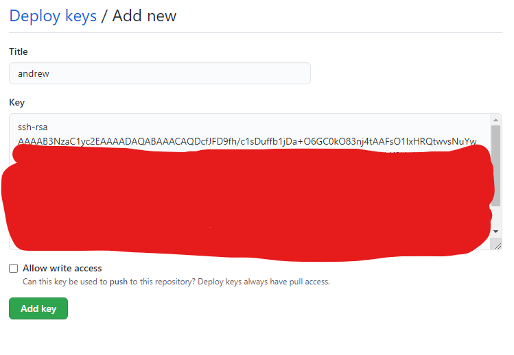

# Why should we use SSH with Git-hub

## SSH keys and Git-hub
### There are two methods to clone the repo

``` SSH AND HTTPS ```
- We have two types repos ```public repo``` 
- second is ```private repo```

There are two methods
 to clone a repository, SSH and HTTP

With public repositories, anybody can fork our code and use it, thus meaning it is not secured

Do avoid this we can make our repo private, meaning our work would be restricted to certain people

- generate SSH keys on your local system
- copy the key from local system to the specific repo on git-hub (ci-start-code)
-.ssh key folder where the ssh keys are available
- name new key as your name andrew

Once in Users/asbo
``` cd .ssh ```
then run in the below command, adding in your email address
``` ssh-keygen -t rsa -b 4096 -C "AOsborne@spartaglobal.com" ```

When prompt with the question "Enter file in which to save the key (/c/Users/aosbo/.ssh/id_rsa):"
enter your name

We then press enter twice to input an empty passphrase and we should be given a key fingerprint

If we run the command ``` cat andrew.pub ``` will give us our public key

We then copy the key and go to settings on the repo we have created and go to the
deploy keys

We then click add deploy key and name the key our name



Jenkins needs authorization from github for the continuous delivery to take place, as a result we have created an SSH
key

Once we push from our computers to github, jenkins will automatically build and test the code with other code
from the project, if passed it will be sent to production, otherwise we will receive a message that the build has failed

In real life, the master branch is the production branch, we don't want to merge here immediately

Jenkins is continuous because every time it receives a commit from the repo we have specified, it will build and then
run the tests

The key we used for github is a padlock, the private key we will use is the key which allows us to use jenkins

SOURCE -->BUILD-->TEST        PRODUCTION
Continuous Integration     Continuous Delivery/Deployment

Deployment is done automatically
Delivery is done manually


## Software Development Life Cycle

Also referred to as SDLC

### **Three Main Stages**
- Development
- Testing
- Release

These stages have been historically slow and hence the importance of DevOps

We cannot put the software in front of the user unless all the tests have been done

As long as we understand the concepts of testing the software, it shouldn't matter what tools we are using
If our software can only deal with 100,000 users, once we reach this level we want to be able to handle the exception,
we'd want to send the users to a 'under construction' page rather than going to a 404

Before DevOps, many applications failed at run time as they weren't continuously integrated and tested repeatedly and thus
you would lose your clients


Continuous delivery comes after the integration and putting the code in a deployable state but it is not yet put in front
of the client
Continuous deployment however is when we release the software to the client and they are able to see it

## Software as a service

SaaS --> Software is licensed on a subscription basis and centrally hosted

SaaS is part of a body of systems that make up cloud computing, other parts include:

- Infrastructure as a service (IaaS)
- desktop as a service (DaaS)
- platform as a service (PaaS)
